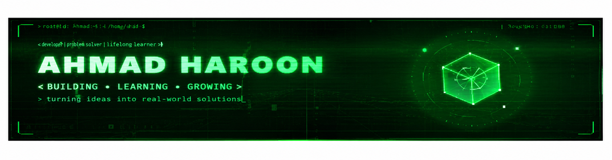

<!-- ═══════════════════════════════════════════════════════════════ -->
<!--   AHMAD-HAROON · PROFILE README · Matrix Terminal Theme v3.0      -->
<!--   SETUP:                                                        -->
<!--   1) header.svg must sit in the ROOT of ahmadharoon101-ai/ahmadharoon101-ai   -->
<!--   2) Snake + 3D graph need GitHub Actions (see chat for YAML)   -->
<!--   3) Personal GitHub, LinkedIn and email details are configured for Ahmad Haroon  -->
<!-- ═══════════════════════════════════════════════════════════════ -->

<div align="center">
  
</div>

<div align="center">
  
</div>

<br/>

<div align="center">
  
  &nbsp;
  
  &nbsp;
  
</div>


##  About Me


```bash
┌──(ahmad㉿matrix)-[~/about-me]
└─$ cat whoami.txt

  Name     : Ahmad Haroon
  Role     : Flutter Developer | Web Developer | AI Intern
  Focus    : Artificial Intelligence | Web Development
  Location : Pakistan 🇵🇰
  Current  : AI Intern at OGDCL
  Backend  : Python | FastAPI | REST APIs
  Frontend : Flutter | HTML | CSS | Responsive UI
  Database : Firebase | Firestore
  Status   : Always Learning & Building ...
```

```bash
┌──(ahmad㉿matrix)-[~/directives]
└─$ tail -f current_objectives.log

  ▸ developing cross-platform mobile applications with Flutter
  ▸ building web applications and responsive user interfaces
  ▸ working on AI-focused software development
  ▸ contributing to healthcare and organizational systems at OGDCL
```

<br clear="right"/>


##  Tech Arsenal

```bash
┌──(ahmad㉿matrix)-[~/tech-stack]
└─$ ls -la skills/ --sort=power
```

### 💻 Languages
<div align="center">
  
</div>

### 🧱 Frameworks & Development
<div align="center">
  
</div>

### 🧠 AI & Data
<div align="center">
  
  <br/><br/>
  
  
  
  
</div>

### 🗄️ Backend, Database & Tools
<div align="center">
  
  <br/><br/>
  
  
</div>


## 🧊 3D Contribution Graph

```bash
┌──(ahmad㉿matrix)-[~/contributions]
└─$ blender --render contributions.blend --engine=MATRIX
```

<div align="center">
  <picture>
    <source media="(prefers-color-scheme: dark)" srcset="https://raw.githubusercontent.com/ahmadharoon101-ai/ahmadharoon101-ai/main/profile-3d-contrib/profile-night-green.svg"/>
    <source media="(prefers-color-scheme: light)" srcset="https://raw.githubusercontent.com/ahmadharoon101-ai/ahmadharoon101-ai/main/profile-3d-contrib/profile-green-animate.svg"/>
    
  </picture>
</div>


## 🚀 Featured Builds

| Project | Description | Stack | Links |
|---------|-------------|-------|-------|
| **Voice Prescription System** | Voice-Based Medicine Prescription Entry System using voice-to-text processing, medicine search, prescription management, Python and FastAPI | Python · FastAPI · Voice-to-Text | [GitHub](https://github.com/ahmadharoon101-ai/voice-prescription-system) |
| **AI Study Planner** | AI-powered study planner for organizing study schedules, tasks, and personalized learning assistance | React · TypeScript · Vite · Firebase · Google Gemini AI | [GitHub](https://github.com/ahmadharoon101-ai/ai-study-planner) |
| **AI Course Recommendation System** | Content-based course recommendation system that analyzes user interests and recommends relevant courses | Python · Pandas · Scikit-learn · Cosine Similarity | [GitHub](https://github.com/ahmadharoon101-ai/AI-Course-Recommendation-System) |
| **Data Classification Using AI** | AI-based classification project using the Iris dataset and K-Nearest Neighbors algorithm, including preprocessing and evaluation | Python · Jupyter Notebook · KNN | [GitHub](https://github.com/ahmadharoon101-ai/project-2-data-classification-using-ai) |
| **Load Balancing using VMs & Auto Scaling** | Cloud infrastructure management platform featuring VM provisioning, load balancing, auto-scaling, resource monitoring, and a centralized dashboard | Cloud Infrastructure | [GitHub](https://github.com/ahmadharoon101-ai/load-balancing-using-vms-and-auto-scaling-in-firebase) |
| **Rule-Based AI Chatbot** | Python-based rule-based chatbot using dictionary-based intent matching for fast response lookup, with CLI effects and input sanitization | Python · Jupyter Notebook | [GitHub](https://github.com/ahmadharoon101-ai/Rule-Based-AI-Chatbot-Python) |


## 📊 GitHub Stats & Analytics

```bash
┌──(ahmad㉿matrix)-[~/stats]
└─$ sudo cat github_analytics.log
```

<div align="center">
  
</div>

<br/>

<div align="center">
  
  
</div>

<br/>

<div align="center">
  
  
</div>

<br/>

<div align="center">
  
</div>


## 🐍 Contribution Snake

<div align="center">
  <picture>
    <source media="(prefers-color-scheme: dark)" srcset="https://raw.githubusercontent.com/ahmadharoon101-ai/ahmadharoon101-ai/output/github-snake-dark.svg"/>
    <source media="(prefers-color-scheme: light)" srcset="https://raw.githubusercontent.com/ahmadharoon101-ai/ahmadharoon101-ai/output/github-snake.svg"/>
    
  </picture>
</div>


---

## 🧠 Daily Interview Question

<!-- START_DAILY_QA -->
<div align="center">

### 🚀 Today's Question: Devops

**What is a load balancer?**

<details>
<summary>💡 Click to reveal answer</summary>

> Distributes traffic across multiple servers. Types: Layer 4 (TCP/UDP) and Layer 7 (HTTP). Improves availability and performance.

</details>

*Question #264 of 60*
</div>
<!-- END_DAILY_QA -->

> 🔄 Daily interview questions | [View All Questions](./daily-qa.md)
>
> ---

## 🌐 Connect With Me

```bash
┌──(ahmad㉿matrix)-[~/connect]
└─$ nmap --open -p social ahmadharoon101-ai
```

<div align="center">
  <a href="https://github.com/ahmadharoon101-ai">
    
  </a>
  &nbsp;
  <a href="https://www.linkedin.com/in/ahmad-haroon-42804b316/">
    
  </a>
  &nbsp;
  <a href="mailto:siyalbadshah255@gmail.com">
    
  </a>

</div>

<br/>

<div align="center">
  
</div>

<div align="center">
  
</div>
